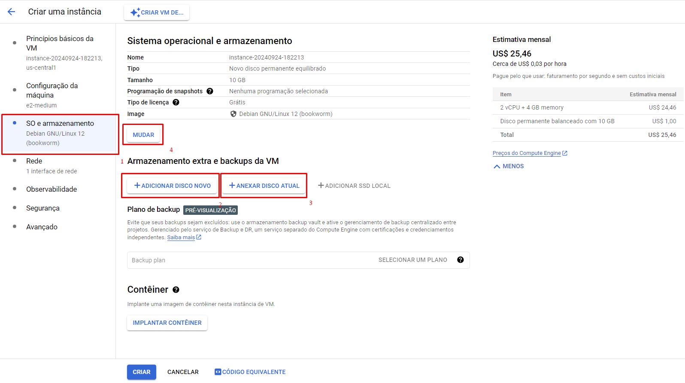

** ATENÇÃO! Se você estiver fazendo o passo-a-passo deste projeto, leia este Readme completo para que não ocorra erros e também cobranças a mais ou inesperadas do google cloud. **

## Configurando o Google cloud

Este projeto utilizou a tecnologia da google cloud para subirmos uma maquina virtual, vou ensinar como fazer essa maquina virtual e as opções de vm.


O google até o momento te disponibiliza até $300,00 dolares de credito para você utilizar para testes, mas deve-se colocar um cartão de credito caso esse credito que a google te disponibiliza seja totalmente utilizado ou foi ultrapassado a data de testes

### Criação do projeto google Cloud

Vamos criar um projeto da google cloud, na foto abaixo mostra para clicar ali em projeto, e depois clicar em novo projeto


Após isso, coloque o nome que você quiser, no caso eu coloquei como MyServerMinecraft, mas você pode colocar da forma que você quiser.


Agora vamos criar a nossa VM, Click no menu e selecione a opção Compute Engine


Se você estiver entrando pela primeira vez, clique em ativar Compute Engine API para ter acesso a esse recurso. Pode demorar alguns instantes para a finalização da ativação desta API.


1 - Para criar a vm vamos colocar um nome, no caso eu coloquei servidor-minecraft mas você pode escolher o nome que mais adequar. neste campo não pode ter espaços

2 - **IMPORTANTE!** neste campo você vai escolher a região onde este serviço que você escolheu vai ficar alocado, neste exemplo eu escolhi US-Central1 que está localizado nos estados unidos, mas você pode escolher em southamerica-east1 ( São paulo ) a unica coisa que vai mudar é o preço como mostra no campo 3 que no caso é o dobro do preço para a hospedagem brasileira. mas vai de acordo com o projeto

3 - a tabela de preços das regiões dos serviços da google, vai depender bastante a região, sempre ficar de olho nesta parte para evitar cobranças indesejadas ou inesperadas.

4 - A zona você pode escolher a vontade, neste projeto eu escolhi a us-central1-b, **Este campo não pode ser alterado depois, para trocar esse campo terá que apenas refazer esse processo de instalação de uma nova VM** 


### Desempenho do computador virtual


Para a configuração de desempenho do computador, você deve verificar o que mais adequaria, como o servidor vai ficar apenas hospedando minecraft talvez não seja necessario algo a mais do que a E2, e também pode personalizar caso futuramente o seu mapa necessite de algo a mais como mais processamento e mais memoria podendo expandir logo abaixo em Tipo de maquina: 


Neste projeto vamos utilizar o **E2-Medium**, caso queira economizar ainda mais caso o seu mapa ou projeto não necessite tantas coisas de memoria, é recomendado o E2-small, mas vai da necessidade de cada projeto

### Sistema operacional - Debian linux

Agora vamos para a configuração do SO e armazenamento, clicando onde indica o 1 a nova area para selecionar o sistema operacional e também o armazenamento extra caso você necessite.

    1 - SO E Armazenamento, proxima etapa de configuração

    2 - 'Adicionar um disco novo' vai criar um disco novo desde o 0.

    3 - 'Anexar disco atual' caso você ja criou um disco novo pela propria google cloud, você pode utilizar essa opção

    4 - 'Mudar' para caso você queira alterar o sistema operacional ( Ubuntu por exemplo ) ou outro. Mas nesse tutorial vamos utilizar o debian. nesta etapa não precisa alterar nada mas caso necessitar só alterar por aqui



### Rede
A parte de rede é super importante para a conexão do minecraft e servidor, e também uma futura configuração de firewall para a conexão


1 - Para configurar a rede vamos seguir para a proxima etapa.


2 - 'Tags de rede' serve para você digitar um nome, e esse nome vai ser vinculado futuramente neste artigo para a permissão de firewall a esta tag de rede, no caso esse projeto utilizou o nome 'minecraft-server', mas pode utilizar o nome que você quiser, e se lembrar quando formos para o firewall para utilizar o mesmo nome que você alterou.


Descendo um pouco, conseguimos ver a Interface de rede, clique em 'default' para expandir a tela


Procure por Endereço IPv4 externo e siga as instruções abaixo:


 1 - Click em endereço IPv4 externo e ele vai abrir uma caixinha, atualmente ele está como temporario o que significa que caso o servidor for reiniciado ele vai alterar o IP, o que dependendo do projeto pode ser um pouco complicado ficar fazendo essa alteração. O recomendado é sempre reservar um endereço de ip externo para que isso não ocorra


 2 - Click em Reservar IP externo estático
 3 - Coloque um endereço de ip a sua escolha, nesse caso eu coloquei o IP mc-example-google-cloud mas você pode utilizar outro
 

 (Opcional) descrição: em casos de projetos muito grande é importante sempre dizer o que esse endereçamento serve, para que não ocorra confusão ou duvidas sobre a funcionalidade deste IP para melhor organização


### Finalização

Após ter concluido todas as etapas apenas clicar em criar logo abaixo para que crie a maquina virtual.


Quando clicar em criar ele vai começar a carregar todas as coisas sobre a VM, o que pode demorar apenas alguns segundos para a finalização


Após isso, click em SSH que vai estar na tabelinha para você se conectar ao console da VM.


## Criação do firewall

    A criação do firewall é super importante para a aplicação, caso contrario nenhum jogador conseguirá acessar esse serviço para jogar neste servidor.

    No menu vá em Rede VPC e depois em firewall como mostra a foto abaixo

   

   Agora click em Criar regra de firewall
   

   Depois disso adicione o nome de sua regra de firewall e a descrição


    1 - Agora vamos colocar a tag de destino no caso no projeto utilizou o nome 'minecraft-server' mas se caso você alterou o nome anteriormente na criação da rede da vm, utilize a mesma.

    2 - em intervalos IPv4 de origem coloque 0.0.0.0/0 para qualquer pessoa consiga acessar o servidor.

    3 - e depois habilite o TCP e adicione a porta 25565


depois é apenas descer a tela e clicar em 'criar' que vai ser criado a tela, pode demorar alguns segundos para a finalização deste processo


## Configuração do linux!

Agora vamos para a reta final que é a configuração e execução do linux para executar o servidor.


após ter inicializado o servidor vamos colocar o comando abaixo para atualizar os pacotes do linux

```
sudo apt update
```

agora vamos instalar o java jdk para executar o servidor do minecraft java

```
sudo apt install default-jdk
```

```
wget https://download.oracle.com/java/21/latest/jdk-21_linux-x64_bin.deb
sudo dpkg -i jdk-21_linux-x64_bin.deb
java -version
```

Para verificar se o JDK do java foi instalado corretamente, execute o comando abaixo para verificar a versão.
```
java --v
```

### Criar as pastas do minecraft

Vamos criar a pasta onde os arquivos do minecraft vão ficar

```
sudo mkdir /home/minecraft
```

depois que criar vá para a pasta do minecraft com o codigo abaixo:
```
cd /home/minecraft
```

Agora na pagina do minecraft vamos copiar a url de download do jar do minecraft, clicando com o botão direito no link de direcionamento e ir em copiar link


agora coloque o codigo abaixo do sudo wget com o link novo que você pegou da pagina oficial do minecraft:

```
    sudo wget (a url que você copiou no site vem aqui)
```

### Instalação do Screen

Agora vamos criar uma screen, essa screen do linux serve para que você consiga utilizar varias telas do linux, e continuar utilizando o terminal caso seja necessario, é bastante util pois é como se fosse as abas do windows. para isso vamos instalar o Screen e depois iniciar o servidor nessa screen

```
sudo apt install screen
```

Depois de instalado o screen, vamos abrir uma nova tela utilizando o comando abaixo, no campo após o -S você pode colocar qualquer nome, neste projeto foi colocado como mc mas você pode escolher o nome que você desejar, e tem que lembrar futuramente para abrir a aba novamente

```
screen -S mc
```
Agora você foi direcionado a tela, para você sair da tela (minimizar a tela) coloque o comando abaixo, você deve pressionar o ctrl a e depois soltar as teclas e apertar a tecla 'd'

```
ctrl + a  d
```

para voltar a aba aberta pelo screen coloque o comando abaixo

```
screen -r (aqui viria o nome que você apelidou a tela, no caso é mc)
```

e para listar todas as abas do screen coloque o comando:
```
screen -ls
```

Agora vamos executar o server.jar utilizando uma tela do screen,mas antes vamos informar que vai ocorrer um erro de eula.txt que eu ja vou comentar abaixo, mas primeiro execute este codigo:

```
sudo java -Xms1024M -Xmx1024M -jar server.jar nogui
```

Uma observação importante é que o campo acima você consegue personalizar quanto de memoria o servidor vai utilizar, no campo -Xms1024M e -Xmx1024 pode ser configurado, e para você saber, é recomendado verificar a capacidade maxima do servidor que você escolheu de memoria ou o quanto de memoria o seu projeto pode utilizar.

    - -Xms1024M representa a memoria minima que o servidor de minecraft vai utilizar
    - -Xmx1024M represemta a memoria maxima que o servidor de minecraft vai utilizar
    Então se você pretente colocar por exemplo 2 GB para o servidor utlizar coloque 2048M , e o 'M' no final da numeração representa MegasByte(MB) mas pode optar por Gigabyte(G)

Após isso vai ocorrer um erro de eula, e então é só abrir o arquivo eula.txt para aceitar os termos. para abrir execute o comando abaixo
```
sudo nano eula.txt
```

quando abrir aperte ctrl + a para editar o arquivo, e altere o eula=false para eula=true. Para fechar o bloco de notas basta aperta a tecla ctrl + x que vai abrir uma caixa de confirmação para salvar o arquivo, aperte 'y' para salvar e depois aperte enter para sair do arquivo.

Após isso só executar o mesmo comando que você executou antes (sudo java -Xms1024M -Xmx1024M -jar server.jar nogui) e ele vai abrir o servidor de minecraft agora.


