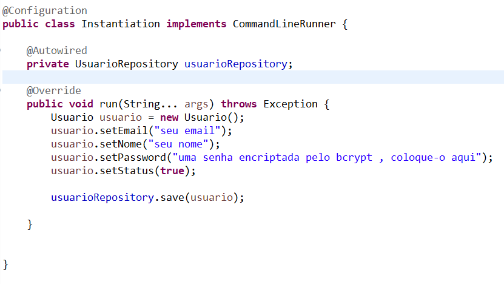
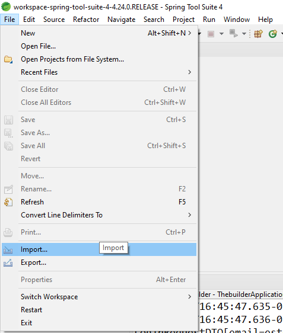
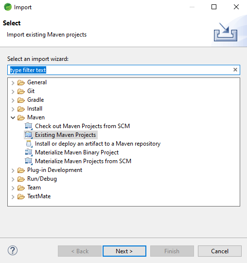
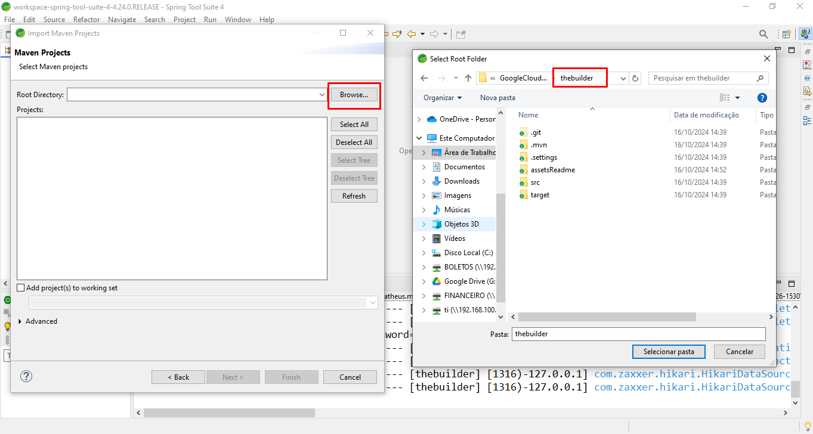
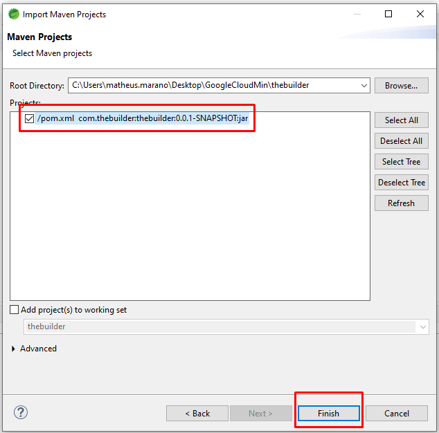
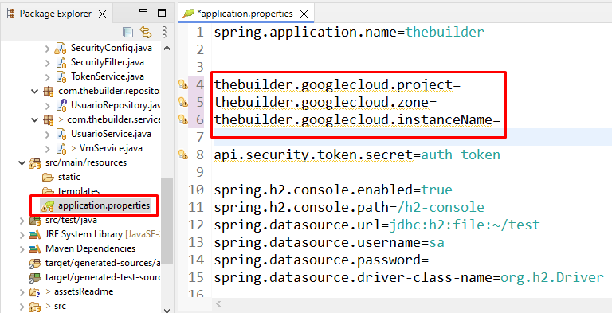
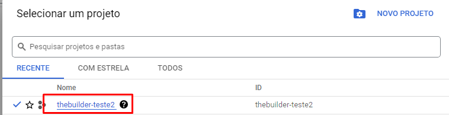

# Inicialização do back-end

O projeto utilizou o SpringBoot com java para a realização do back-end

Vamos primeiro fazer algumas configurações que é necessário para o back-end ser executado. Neste caso vamos utilizar o eclipse mas você pode utilizar qualquer IDE como intelliJ no qual é recomendado também

No Eclipse (SpringTools) vamos importar o projeto que foi baixado. clique em FILE > IMPORT igual mostra no print abaixo

Após isso vai abrir a caixinha e você seleciona o maven e depois clique em Existing Maven projects

O proximo passo e você selecionar a pasta que está os arquivos, a pasta que está localizada o pom.xml

Quando você selecionar a pasta, se tudo ocorreu bem vai aparecer o arquivo do pom.xml Após isso só clicar em 'Finish'

No arquivo em src/main/resources existe um arquivo chamado application.properties. abra ele e siga o passo a passo

em thebuilder.googlecloud.project coloque o projeto da sua google cloud
em thebuilder.googlecloud.zone coloque a zona que o servidor está localizado como southamerica, us-central1-a,etc
em thebuilder.googlecloud.instanceName coloque o nome da instancia que você quer

Se caso você tiver diversos servidores na google cloud, você poderá salvar essas informações em um banco de dados, e puxar cada um em forma de tabela.

Agora vamos configurar o primeiro usuario, com este usuario você conseguirá criar os proximos usuarios.

no arquivo Instantiation você vai configurar o seu usuario para o seu login. abra ele e dentro das aspaz coloque o seu email, seu nome, sua senha **A SENHA DEVE SER ENCRIPTADA ANTES PELO BCRYPT para você conseguir fazer o login**

