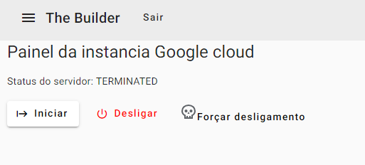

## Development server

Run `ng serve` for a dev server. Navigate to `http://localhost:4200/`. The application will automatically reload if you change any of the source files.

## Code scaffolding

Run `ng generate component component-name` to generate a new component. You can also use `ng generate directive|pipe|service|class|guard|interface|enum|module`.

## Build

Run `ng build` to build the project. The build artifacts will be stored in the `dist/` directory.

## Running unit tests

Run `ng test` to execute the unit tests via [Karma](https://karma-runner.github.io).

## Running end-to-end tests

Run `ng e2e` to execute the end-to-end tests via a platform of your choice. To use this command, you need to first add a package that implements end-to-end testing capabilities.

## Further help

To get more help on the Angular CLI use `ng help` or go check out the [Angular CLI Overview and Command Reference](https://angular.io/cli) page.

# Sobre o projeto Front-end

O projeto foi realizado com o angular [Angular CLI](https://github.com/angular/angular-cli) version 17.3.9. conseguindo de forma mais gráfica e visualmente ser bastante eficiente e o usuário conseguir saber o que fazer

A primeira tela é de login, que para você acessar as outra telas como o painel de controle e o acesso de outros jogadores, você precisa antes criar o login no back-end. recomenda-se ler o readme do back-end para criar esse acesso.

A primeira tela após o login você ja vai ser direcionado para a tela do painel, se tudo ocorreu bem no back-end você verá o status da instancia. se depois dos dois pontos ":" do status em 'Status do servidor : ' for fazio, é por que o site ou o back-end não conseguiu se conectar ao servidor da google cloud OU o front-end não está conseguindo se conectar o back-end.

No caso a imagem que está abaixo mostra o status TERMINATED no qual ela está desligada.

Abaixo do status tem 3 botões que você consegue desligar o Iniciar o servidor, Desligar e forçar o desligamento.

Acima no menu tem o 'Jogadores' no qual você pode adicionar mais de um usuario fora você a ter acesso a essas Maquinas virtuais. preencha o formulario clicando em adicionar e ele vai abrir o formulario para você preencher.

Uma curiosidade deste projeto caso você tenha mais de uma VM, você pode salvar todas os codigos da vm como zonas, nome do projeto e o nome da VM em um banco de dados, e daria para você encaminhar para o banco de dados determinada vm que você quer que ligue.

