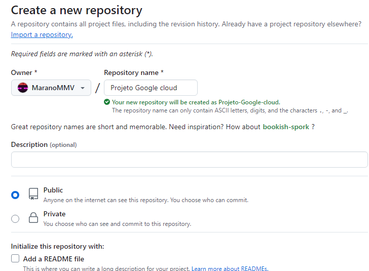

# Criando um repositorio no git
Antes de continuar, você precisa de uma conta no github para colocar o projeto dentro da google cloud, também ter instalado o Git no computador para acessar. É uma forma bem mais facil de clonar o repositorio dentro da google cloud

crie o repositoriuo no git, escolha o nome e selecione a forma que você quer que este tipo de arquivo esteja, seja publico ou privado. Neste caso recomendamos utilizar o repositorio **PUBLICO** caso contrario você terá que fazer o SSH para o git.

Para ler mais sobre o SSH acesse: https://docs.github.com/pt/apps/creating-github-apps/about-creating-github-apps/about-creating-github-apps



Agora vamos subir o codigo para o git. para isso abra o Git Bash no git na pasta central do projeto (de preferencia apenas do back-end)

```
 git init
 git add .
 git branch -M main 
```

No git commit que é o comando que vai estar abaixo, deixe um comentario para saber o que este commit significa

```
 git commit -m "SEU COMENTARIO"
```
agora vamos adicionar uma origem remota do git. pra isso copie a url do seu git e coloque no campo abaixo que está em URL_DO_GIT
 

```
 git remote add origin URL_DO_GIT
```

Agora vamos enviar para o git!

```
git push -u origin main
```

Verifique se os seus arquivos do git estão lá no site do github.
